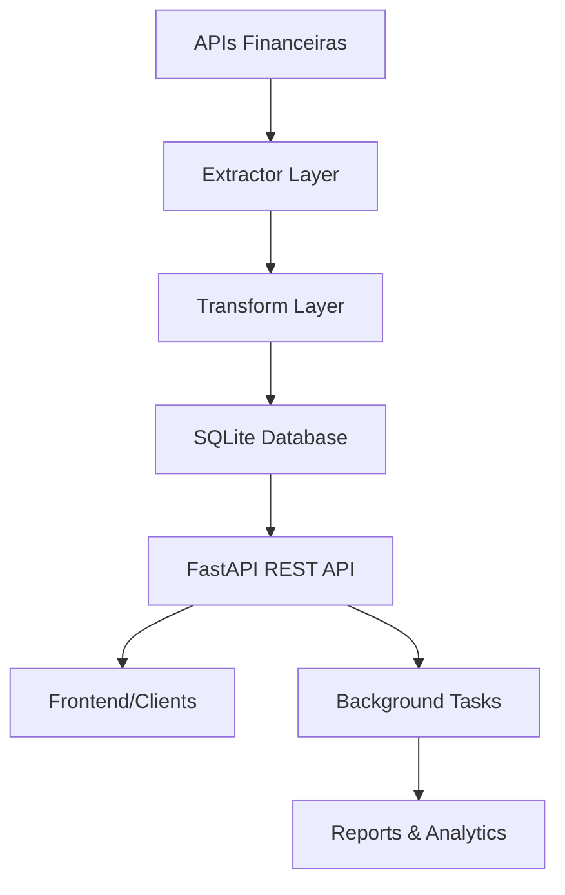

# 🚀 Financial Data Pipeline

> **Pipeline ETL profissional para análise de dados financeiros em tempo real com Python, FastAPI e SQLite**

[](https://python.org)
[](https://fastapi.tiangolo.com)
[](https://sqlite.org)
[](https://pandas.pydata.org)
[](https://python-poetry.org)

## 📋 Sobre o Projeto

Este projeto implementa um **pipeline ETL completo** para coleta, processamento e análise de dados financeiros de ações, oferecendo uma **API REST robusta** para consumo dos dados em tempo real.

### 🎯 **Problema Resolvido**
Investidores e analistas precisam de acesso rápido e confiável a dados financeiros estruturados, com análises automatizadas e APIs para integração com outras ferramentas.

### 💡 **Solução Desenvolvida**
Sistema completo de engenharia de dados que:
- **Extrai** dados de múltiplas fontes (Yahoo Finance, Alpha Vantage)
- **Transforma** e limpa os dados com Pandas
- **Carrega** em banco SQLite com schema otimizado
- **Serve** via API REST com FastAPI
- **Analisa** automaticamente com métricas financeiras

## 🏗️ Arquitetura do Sistema



## ⭐ Funcionalidades Principais

### 🔄 **Pipeline ETL Robusto**
- ✅ Extração de dados em tempo real de múltiplas APIs
- ✅ Transformação e limpeza automática com Pandas
- ✅ Validação de dados com Pydantic
- ✅ Rate limiting inteligente e tratamento de erros
- ✅ Fallback automático para dados simulados

### 🚀 **API REST Profissional**
- ✅ 6 endpoints documentados com Swagger
- ✅ Processamento assíncrono com Background Tasks
- ✅ Health checks para monitoramento
- ✅ Validação automática de requests/responses
- ✅ CORS configurado para integração frontend

### 📊 **Análises Automatizadas**
- ✅ Métricas financeiras (volatilidade, médias móveis)
- ✅ Detecção automática de tendências
- ✅ Recomendações de compra/venda
- ✅ Relatórios executivos em CSV/Excel
- ✅ Análises estatísticas com Pandas

## 🛠️ Tecnologias Utilizadas

| Categoria | Tecnologia | Propósito |
|-----------|------------|-----------|
| **Linguagem** | Python 3.10+ | Desenvolvimento principal |
| **Framework Web** | FastAPI | API REST de alto performance |
| **Dados** | Pandas + NumPy | Análise e manipulação de dados |
| **Banco** | SQLite | Armazenamento persistente |
| **Validação** | Pydantic | Validação de schemas |
| **Dep. Management** | Poetry | Gerenciamento de dependências |
| **APIs Externas** | Yahoo Finance, Alpha Vantage | Dados financeiros |
| **Testing** | Pytest | Testes automatizados |

## 🚦 Quick Start

### 📋 **Pré-requisitos**
- Python 3.10 ou superior
- Poetry (gerenciador de dependências)

### ⚡ **Instalação Rápida**

```bash
# 1. Clonar repositório
git clone https://github.com/seu-usuario/financial-data-pipeline.git
cd financial-data-pipeline

# 2. Instalar dependências
poetry install

# 3. Ativar ambiente virtual
poetry shell

# 4. Executar API
python api_financeira.py
```

### 🎯 **Uso Básico**

```bash
# Testar a API
python teste_api.py

# Executar ETL standalone
python etl_robusto_windows.py

# Acessar documentação interativa
# http://localhost:8000/docs
```

## 📚 Exemplos de Uso

### 🔌 **Consumindo a API**

```python
import requests

# Obter dados de uma ação
response = requests.get("http://localhost:8000/acoes/AAPL")
dados = response.json()
print(f"Apple: R$ {dados['preco']} ({dados['variacao']:+.2f}%)")

# Analisar portfolio
portfolio = {
    "simbolos": ["AAPL", "MSFT", "PETR4.SA"],
    "incluir_historico": False
}
response = requests.post("http://localhost:8000/portfolio/analisar", json=portfolio)
analise = response.json()
```

### 📊 **ETL Direto**

```python
from etl_robusto_windows import ETLFinanceiroRobusto

# Inicializar ETL
etl = ETLFinanceiroRobusto()

# Processar ações
dados = etl.processar_portfolio(['AAPL', 'MSFT', 'GOOGL'])

# Gerar relatórios
etl.gerar_relatorio_executivo(dados)
```

## 🏗️ Estrutura do Projeto

```
financial-data-pipeline/
├── 📁 src/
│   ├── 📄 api_financeira.py           # API REST principal
│   ├── 📄 etl_robusto_windows.py      # Pipeline ETL
│   └── 📄 teste_api.py                # Cliente de testes
├── 📁 data/
│   ├── 📁 raw/                        # Dados brutos
│   ├── 📁 processed/                  # Dados processados
│   └── 📄 portfolio.db                # Banco SQLite
├── 📁 reports/                        # Relatórios gerados
├── 📁 logs/                           # Logs do sistema
├── 📁 tests/                          # Testes automatizados
├── 📄 pyproject.toml                  # Configuração Poetry
├── 📄 .gitignore                      # Arquivos ignorados
└── 📄 README.md                       # Este arquivo
```

## 🔧 Endpoints da API

| Método | Endpoint | Descrição |
|--------|----------|-----------|
| `GET` | `/` | Status da API |
| `GET` | `/health` | Health check do sistema |
| `GET` | `/acoes/{codigo}` | Dados de ação específica |
| `POST` | `/portfolio/analisar` | Análise completa de portfolio |
| `GET` | `/portfolio/historico` | Histórico do banco de dados |
| `POST` | `/etl/executar` | Executar pipeline ETL |

### 📖 **Documentação Interativa**
Acesse `http://localhost:8000/docs` para documentação completa com interface Swagger.

## 📈 Demonstração

### **Análise de Portfolio - Output de Exemplo:**

```json
{
  "estatisticas": {
    "total_ativos": 4,
    "preco_medio": 156.75,
    "volume_total": 25480000,
    "variacao_media": 1.23
  },
  "performance": {
    "melhor_acao": {"codigo": "AAPL", "variacao": 3.45},
    "pior_acao": {"codigo": "PETR4.SA", "variacao": -1.20}
  },
  "recomendacoes": [
    "🚀 AAPL: Forte alta (+3.45%) - Acompanhar tendência",
    "⚠️ PETR4.SA: Queda moderada (-1.20%) - Avaliar compra"
  ]
}
```

## 🧪 Executando Testes

```bash
# Testes da API
python teste_api.py

# Testes unitários (quando implementados)
poetry run pytest tests/

# Coverage
poetry run pytest --cov=src tests/
```

## 🐳 Docker (Opcional)

```dockerfile
FROM python:3.10-slim

WORKDIR /app
COPY pyproject.toml poetry.lock ./
RUN pip install poetry && poetry install --no-dev

COPY . .
EXPOSE 8000

CMD ["python", "api_financeira.py"]
```

## 🔧 Configuração Avançada

### **Variáveis de Ambiente** (`.env`)
```bash
# API Keys (opcional)
ALPHA_VANTAGE_API_KEY=sua_chave_aqui

# Configurações do banco
DATABASE_URL=sqlite:///data/portfolio.db

# Configurações da API
API_HOST=0.0.0.0
API_PORT=8000
```

## 🎯 Roadmap / Próximas Funcionalidades

- [ ] 🐳 **Containerização completa** com Docker Compose
- [ ] 🔄 **CI/CD** com GitHub Actions
- [ ] 📊 **Dashboard web** com Streamlit/Dash
- [ ] 🏢 **PostgreSQL** para produção
- [ ] 📧 **Alertas automáticos** por email
- [ ] 🤖 **Machine Learning** para predições
- [ ] 🔐 **Autenticação JWT**
- [ ] 📱 **API mobile-first**

## 🤝 Contribuindo

1. Fork o projeto
2. Crie uma branch (`git checkout -b feature/nova-funcionalidade`)
3. Commit suas mudanças (`git commit -m 'Add: nova funcionalidade'`)
4. Push para a branch (`git push origin feature/nova-funcionalidade`)
5. Abra um Pull Request

## 📄 Licença

Este projeto está sob a licença MIT. Veja [LICENSE](LICENSE) para mais detalhes.

## 👨‍💻 Autor

**Victor Soares**
- 💼 LinkedIn: [seu-perfil](https://www.linkedin.com/in/victor-soares-ferreira-7b479718a/)
- 🐙 GitHub: [Victor](https://github.com/victorsoaresferreiraa)
- 📧 Email: victorsoaresferreira09@gmail.com

## 🙏 Agradecimentos

- Yahoo Finance pela API gratuita de dados financeiros
- FastAPI pela excelente documentação
- Comunidade Python pela inspiração

---

<div align="center">

**⭐ Se este projeto foi útil, deixe uma estrela!**

[](https://github.com/seu-usuario/financial-data-pipeline/stargazers)

</div>